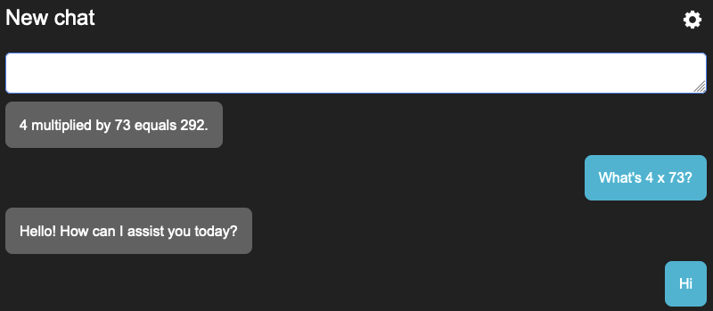
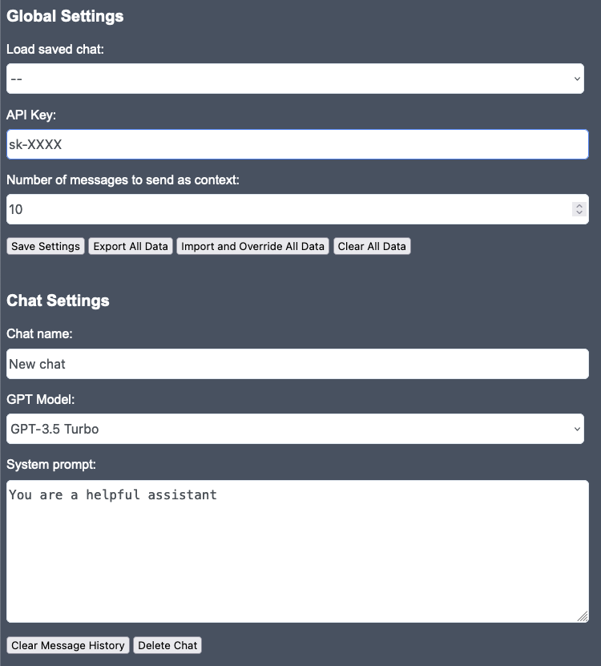

# Chat

A simple, completely client-side web UI for ChatGPT. All configuration and chat history is stored in the browser's local storage. You'll need to BYO API key, which you can get [here](https://platform.openai.com).

<center>




</center>

## Live Demo
https://benrhughes.github.io/chat-demo/

## Build
You can clone the [demo repo](https://github.com/benrhughes/chat-demo) if you want the latest built version. 

If you'd like to build it yourself:
```
git clone https://github.com/benrhughes/chat.git
cd chat
npm install
npm run build
```

Serve the contents of the `dist` folder.


