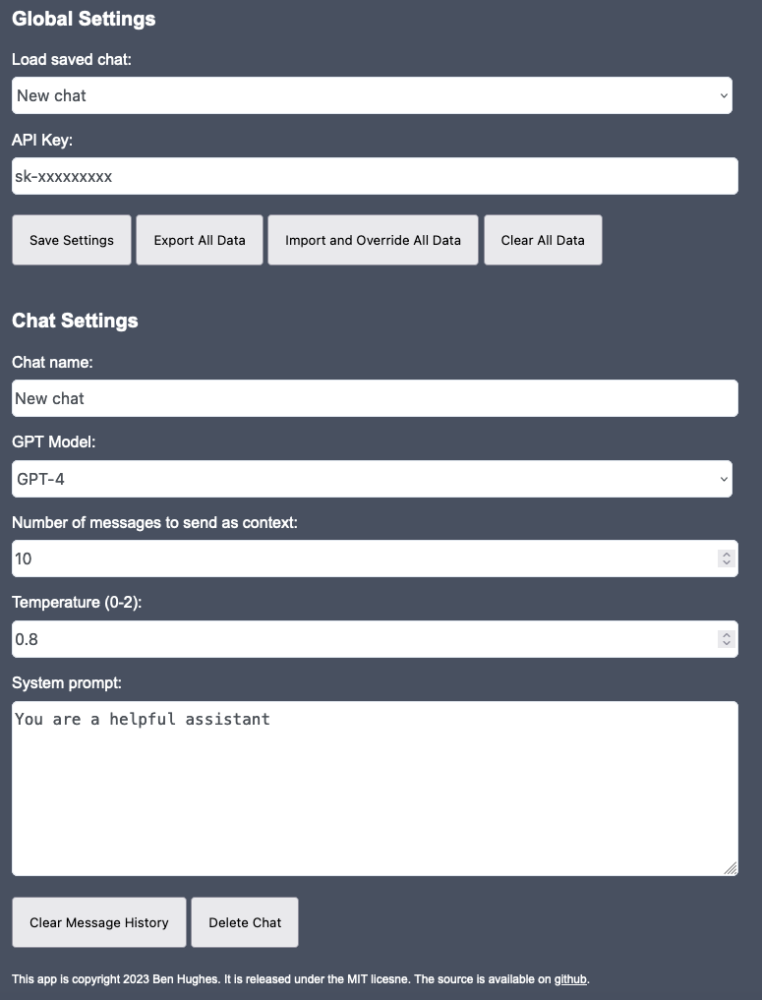

# Chat

A simple, completely client-side web UI for ChatGPT. All configuration and chat history is stored in the browser's local storage. You'll need to BYO API key, which you can get [here](https://platform.openai.com).

<center>



</center>

## Live Demo
https://benrhughes.github.io/chat-demo/

## Build
```
git clone https://github.com/benrhughes/chat.git
cd chat
npm install
npm run build
```

Serve the contents of the `dist` folder, or you can simply download the [demo](https://benrhughes.github.io/chat-demo/).


